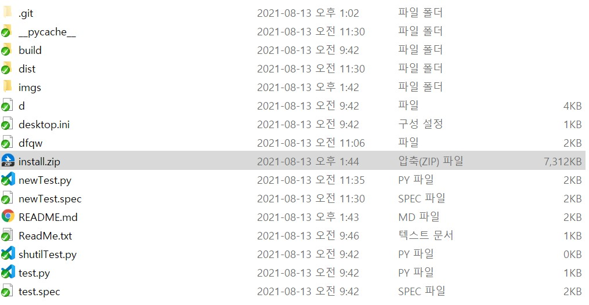
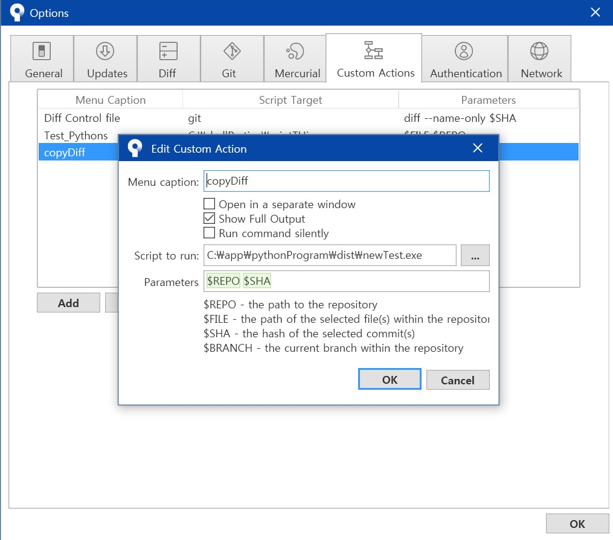
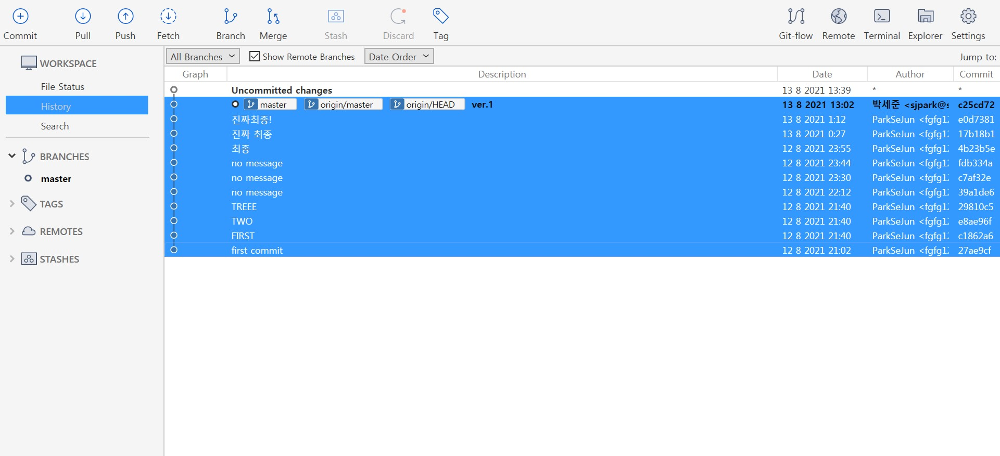
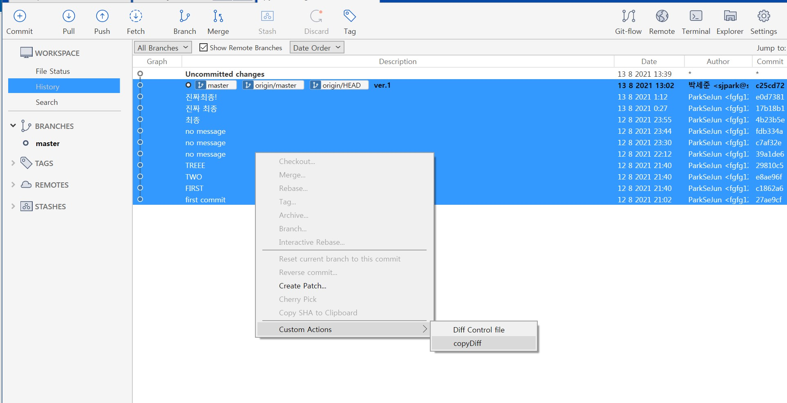

# 소스트리 커스텀 액션 가이드

해당 파일은 파이썬으로 개발되어 있습니다.
소스트리의 커스텀 액션을 활용해서,  
두 커밋간에 새로 추가되거나, 내용이 바뀐 파일을 추적하여
C:/CopyFiles에 추가합니다.

사용법:
1. install.zip 설치 및 압축해제
2. 소스트리 커스텀 액션 설정
3. 실행 방법

## 프로젝트 내의 install.zip 을 설치받습니다.

프로젝트 내부의 install.zip을 설치하고 압축을 해제합니다.

## 소스트리 커스텀 액션 설정

소스트리에서 커스텀 액션을 설정합니다.
소스트리 메인화면 - TOOLS - OPTIONS - CUSTOM ACTIONS로 이동합니다.

ADD를 눌러 새로운 커스텀 액션을 추가합니다. 해당 설정은 다음 이미지와 같습니다.
Menu caption 의 이름과 exe파일의 경로는 바뀌여도 상관없습니다.

## 실행 방법

파일을 검색해 볼 커밋 간의 구역을 설정합니다.

실행에는 두가지 방법이 있습니다.
  - 마우스 우클릭 - 커스텀 액션 - 해당 액션 
  - 소스트리 탭의 액션 - 커스텀 액션 - 해당 액션

